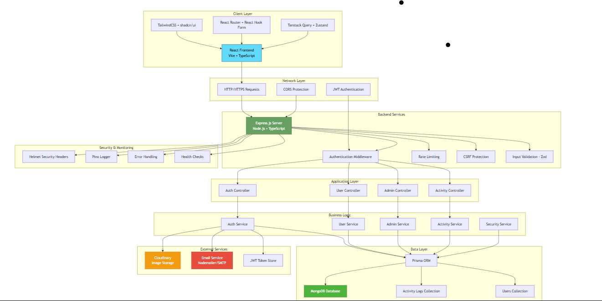

# User Management System (UMS)

A comprehensive, modern User Management System built with the MERN stack, featuring role-based access control, secure authentication, and a beautiful responsive UI.

## 🌟 Overview

This User Management System provides a complete solution for managing users, roles, and permissions in modern web applications. Built with security, scalability, and user experience in mind.

## 🚀 Live Demo

[Click here to view the live site](https://mern-ums-app.vercel.app/)

### Key Features

- 🔐 **Secure Authentication** - JWT-based auth with refresh tokens
- 👥 **Role-Based Access Control** - Admin, Developer, Moderator, Client roles
- 🛡️ **Advanced Security** - CSRF protection, rate limiting, input validation
- 📱 **Responsive Design** - Mobile-first, modern UI with dark/light themes
- 📊 **Activity Tracking** - Comprehensive user activity logging
- 🖼️ **Image Management** - Cloudinary integration for profile pictures
- 📧 **Email System** - Verification, password reset, notifications
- 🔍 **Advanced Filtering** - Search, sort, and filter users and activities
- 📈 **Dashboard Analytics** - User statistics and system insights

## 📸 Screenshots & Features

### 🔐 Authentication & Email System

#### Sign In & Registration

<div align="center">
  
  
</div>

#### Email Verification & Password Reset

<div align="center">
  
  
  
</div>

#### Email Templates

<div align="center">
  
  
</div>

### 📊 Dashboard Views

#### Role-Based Dashboards

<div align="center">
  
  
</div>

<div align="center">
  
</div>

### 👥 User Management

#### User Administration & Profile Management

<div align="center">
  
  
</div>

<div align="center">
  
  
</div>

### ⚡ Features & Settings

#### Activity Logs & System Features

<div align="center">
  
  
</div>

#### Dark Mode Support

<div align="center">
  
</div>

## 🏗️ Architecture

<div align="center">
  
</div>

### System Overview

```
┌─────────────────┐    ┌─────────────────┐    ┌─────────────────┐
│                 │    │                 │    │                 │
│   Frontend      │◄──►│   Backend       │◄──►│   Database      │
│   (React)       │    │   (Node.js)     │    │   (MongoDB)     │
│                 │    │                 │    │                 │
└─────────────────┘    └─────────────────┘    └─────────────────┘
         │                       │                       │
         │                       │                       │
    ┌────▼────┐             ┌────▼────┐             ┌────▼────┐
    │ Vite    │             │ Express │             │ Prisma  │
    │ TailWind│             │ TypeScript│           │ ORM     │
    │ shadcn/ui│            │ Zod     │             │         │
    └─────────┘             └─────────┘             └─────────┘
```

## 🛠️ Tech Stack

### Frontend Technologies

| Technology          | Purpose           | Why Use It                                                                                     |
| ------------------- | ----------------- | ---------------------------------------------------------------------------------------------- |
| **React**           | UI Library        | Component-based architecture, excellent ecosystem, and widespread community support            |
| **TypeScript**      | Type Safety       | Catches errors at compile-time, improves code maintainability and developer experience         |
| **Vite**            | Build Tool        | Lightning-fast development server, optimized bundling, and modern ES module support            |
| **TailwindCSS**     | Styling           | Utility-first approach, rapid prototyping, consistent design system, and excellent performance |
| **shadcn/ui**       | Component Library | Beautiful, accessible components built on Radix UI with TailwindCSS styling                    |
| **React Router**    | Navigation        | Declarative routing, nested routes, and excellent TypeScript support                           |
| **React Hook Form** | Form Management   | Minimal re-renders, excellent performance, and built-in validation support                     |
| **Zod**             | Schema Validation | Type-safe validation schemas that integrate seamlessly with TypeScript                         |
| **Tanstack Query**  | Data Fetching     | Caching, background updates, optimistic updates, and excellent developer experience            |
| **Zustand**         | State Management  | Simple, lightweight state management without boilerplate                                       |

### Backend Technologies

| Technology     | Purpose             | Why Use It                                                                           |
| -------------- | ------------------- | ------------------------------------------------------------------------------------ |
| **Node.js**    | Runtime Environment | JavaScript everywhere, large ecosystem, excellent performance for I/O operations     |
| **Express.js** | Web Framework       | Mature, flexible, extensive middleware ecosystem, and great TypeScript support       |
| **TypeScript** | Type Safety         | Enhanced code quality, better refactoring, and improved developer productivity       |
| **Prisma**     | Database ORM        | Type-safe database access, excellent migrations, and intuitive query interface       |
| **MongoDB**    | Database            | Flexible schema, horizontal scaling, excellent performance for modern applications   |
| **JWT**        | Authentication      | Stateless authentication, scalable across multiple servers, and industry standard    |
| **bcrypt**     | Password Hashing    | Secure password hashing with salt, resistance against rainbow table attacks          |
| **Zod**        | Input Validation    | Runtime type checking, seamless TypeScript integration, and excellent error messages |
| **Cloudinary** | Image Management    | CDN delivery, automatic optimization, transformations, and reliable storage          |
| **Nodemailer** | Email Service       | Flexible email sending, support for multiple providers, and template support         |

### Development & Security Tools

| Technology        | Purpose                       | Why Use It                                                                           |
| ----------------- | ----------------------------- | ------------------------------------------------------------------------------------ |
| **Jest**          | Testing Framework             | Comprehensive testing features, snapshot testing, and excellent mocking capabilities |
| **ESLint**        | Code Linting                  | Enforces code quality standards and catches potential bugs early                     |
| **Prettier**      | Code Formatting               | Consistent code style across team members and automated formatting                   |
| **Helmet**        | Security Headers              | Protects against common web vulnerabilities by setting security headers              |
| **CORS**          | Cross-Origin Resource Sharing | Secure API access from frontend with configurable origin policies                    |
| **Rate Limiting** | API Protection                | Prevents abuse and DDoS attacks with configurable limits per endpoint                |
| **Pino**          | Logging                       | High-performance logging with structured output for better debugging                 |

### Why This Stack?

#### **🚀 Performance**

- **Vite** provides instant server startup and lightning-fast HMR
- **React** with concurrent features for better user experience
- **Prisma** with efficient query generation and connection pooling
- **TailwindCSS** with optimized CSS purging for minimal bundle size

#### **🔒 Security**

- **TypeScript** catches security vulnerabilities at compile-time
- **Zod** provides runtime input validation preventing injection attacks
- **bcrypt** ensures secure password storage with proper salting
- **JWT** with refresh tokens for secure, stateless authentication
- **Helmet** and **CORS** protect against common web vulnerabilities

#### **👥 Developer Experience**

- **TypeScript** provides excellent autocomplete and refactoring support
- **Prisma** offers type-safe database operations with great IDE integration
- **shadcn/ui** provides copy-paste components with consistent design
- **React Hook Form** simplifies form handling with minimal boilerplate
- **Jest** provides comprehensive testing with great debugging tools

#### **📈 Scalability**

- **MongoDB** handles large datasets with horizontal scaling capabilities
- **Prisma** connection pooling optimizes database performance
- **Cloudinary** CDN ensures fast image delivery globally
- **JWT** stateless authentication scales across multiple servers
- **React** component architecture promotes code reusability

#### **🔧 Maintainability**

- **TypeScript** reduces runtime errors and improves code documentation
- **Prisma** handles database migrations and schema evolution
- **ESLint + Prettier** ensures consistent code quality across the team
- **Modular architecture** with clear separation of concerns
- **Comprehensive testing** with unit, integration, and E2E tests

## 🚀 Quick Start

For a **complete step-by-step setup guide** with troubleshooting and detailed configurations, see:

📋 **[Complete Setup Guide](./SETUP_GUIDE.md)**

### Prerequisites

- **Node.js** (v18 or higher)
- **MongoDB** (local or cloud instance)
- **Cloudinary Account** (for image uploads)
- **Email Service** (Gmail, SendGrid, etc.) (Using Mailtrap in Development)

### 1. Clone Repository

```bash
git clone <repository-url>
cd mern-ums-app
```

### 2. Backend Setup

```bash
cd backend
npm install
cp env.example .env
# Configure your .env file (see Backend Configuration below)
npm run db:generate
npm run db:push
npm run seed:test-data  # Optional: Add test data
npm run dev
```

### 3. Frontend Setup

```bash
cd frontend
npm install
cp .env.example .env
# Configure your .env file (see Frontend Configuration below)
npm run dev
```

### 4. Access Application

- **Frontend**: http://localhost:5173
- **Backend API**: http://localhost:5000
- **Database Studio**: `npm run db:studio` (in backend directory)

## ⚙️ Configuration

### Backend Environment Variables

```env
# Server Configuration
PORT=5000
NODE_ENV=development

# Database
MONGODB_URI=mongodb://localhost:27017/ums_db

# JWT Secrets
JWT_SECRET=your-super-secret-jwt-key-min-32-chars
JWT_EXPIRE=7d
JWT_REFRESH_SECRET=your-super-secret-refresh-key-min-32-chars
JWT_REFRESH_EXPIRE=30d

# Email Configuration
EMAIL_HOST=sandbox.smtp.mailtrap.io
EMAIL_PORT=2525
EMAIL_USER=your-mailtrap-username
EMAIL_PASS=your-mailtrap-password

# Cloudinary (Image Upload)
CLOUDINARY_CLOUD_NAME=your-cloud-name
CLOUDINARY_API_KEY=your-api-key
CLOUDINARY_API_SECRET=your-api-secret

# Frontend URL
FRONTEND_URL=http://localhost:5173

# Security
CSRF_SECRET=your-csrf-secret-key
RATE_LIMIT_WINDOW_MS=900000
RATE_LIMIT_MAX_REQUESTS=100

# Logging
LOG_LEVEL=info
```

### Frontend Environment Variables

```env
# API Configuration
VITE_API_URL=http://localhost:5000/api

# App Information
VITE_APP_NAME=World IT UMS
VITE_APP_VERSION=1.0.0
VITE_APP_DESCRIPTION=User Management System

# Feature Flags
VITE_ENABLE_REGISTRATION=true
VITE_ENABLE_EMAIL_VERIFICATION=true
```

## 🛠️ Development

### Backend Development

```bash
cd backend

# Development server with hot reload
npm run dev

# Build TypeScript
npm run build

# Run tests
npm test
npm run test:watch
npm run test:coverage

# Database operations
npm run db:generate    # Generate Prisma client
npm run db:push       # Push schema changes
npm run db:migrate    # Run migrations
npm run db:studio     # Open Prisma Studio
npm run db:reset      # Reset database

# Utility scripts
npm run seed:test-data    # Seed test data
npm run test:email       # Test email configuration
npm run test:cloudinary  # Test Cloudinary setup
```

### Frontend Development

```bash
cd frontend

# Development server
npm run dev

# Build for production
npm run build

# Preview production build
npm run preview

# Linting
npm run lint
```

## 📊 Database Schema

<div align="center">
  
</div>

### Database Models

#### User Model

```prisma
model User {
  id                    String    @id @default(auto()) @map("_id") @db.ObjectId
  name                  String
  email                 String    @unique
  password              String
  phone                 String?
  role                  UserRole  @default(CLIENT)
  status                UserStatus @default(ACTIVE)
  emailVerified         Boolean   @default(false)
  emailVerificationToken String?
  passwordResetToken    String?
  passwordResetExpires  DateTime?
  profilePicture        String?
  createdAt             DateTime  @default(now())
  updatedAt             DateTime  @updatedAt
  activityLogs          ActivityLog[]
}

enum UserRole {
  ADMIN
  DEVELOPER
  MODERATOR
  CLIENT
}

enum UserStatus {
  ACTIVE
  INACTIVE
  SUSPENDED
}
```

### Activity Log Model

```prisma
model ActivityLog {
  id          String   @id @default(auto()) @map("_id") @db.ObjectId
  userId      String   @db.ObjectId
  activity    String
  details     String?
  ipAddress   String?
  userAgent   String?
  createdAt   DateTime @default(now())
  user        User     @relation(fields: [userId], references: [id], onDelete: Cascade)
}
```

## 🔐 Security Features

### Authentication & Authorization

- JWT-based authentication with refresh tokens
- Role-based access control (RBAC)
- Password hashing with bcrypt
- Email verification system
- Password reset functionality

### Security Middleware

- CSRF protection with token validation
- Rate limiting (global and per-user)
- Input validation with Zod schemas
- Security headers with Helmet
- CORS configuration

### Data Protection

- SQL injection prevention (Prisma ORM)
- XSS protection
- Secure file uploads to Cloudinary
- Environment variable validation
- Audit logging for sensitive operations

## 🎨 UI/UX Features

### Design System

- Modern, clean interface built with shadcn/ui
- Consistent color palette and typography
- Dark/light theme support
- Responsive design (mobile-first)
- Accessibility compliant (WCAG 2.1)

### User Experience

- Intuitive navigation with role-based menus
- Real-time toast notifications
- Loading states and error handling
- Form validation with helpful messages
- Keyboard navigation support

## 📱 API Documentation

For complete API documentation including all endpoints, request/response schemas, authentication requirements, and examples, please refer to:

📖 **[API Documentation](./API.md)**

The API documentation covers:

- **Authentication & Authorization** - Login, registration, token management
- **User Management** - Profile operations, password management, image uploads
- **Admin Operations** - User administration, activity logs, dashboard analytics
- **Activity Tracking** - User activity monitoring and statistics
- **Error Handling** - Standard error responses and status codes
- **Rate Limiting** - API limits and throttling policies
- **Request/Response Examples** - Sample requests and responses for all endpoints

## 🔒 Security Documentation

For comprehensive security information including implemented security measures, vulnerability management, and security best practices, please refer to:

🛡️ **[Security Documentation](./SECURITY.md)**

The security documentation covers:

- **Authentication & Authorization** - JWT security, RBAC, admin protections
- **Data Protection** - Encryption, privacy measures, data retention policies
- **Input Validation** - XSS/CSRF/SQL injection prevention, Zod schemas
- **Network Security** - CORS configuration, security headers, HTTPS/TLS
- **Rate Limiting & DDoS Protection** - API limits, brute force prevention
- **Vulnerability Management** - Reporting procedures, incident response
- **Security Best Practices** - Development, deployment, and maintenance guidelines
- **Compliance & Standards** - OWASP, NIST, GDPR alignment
- **Security Checklists** - Phase-by-phase security verification

## 🚀 Deployment

For complete Deployment Documentation, please refer to:

**[Deployment Documentation](./DEPLOYMENT.md)**

### Production Build

#### Backend

```bash
cd backend
npm run build
npm start
```

#### Frontend

```bash
cd frontend
npm run build
# Serve dist/ folder with your preferred web server
```

### Environment Setup

#### Production Environment Variables

- Use strong, unique secrets for JWT and CSRF
- Configure proper CORS origins
- Set up production database
- Configure email service
- Set up Cloudinary for production
- Enable proper logging levels

## 🧪 Testing

### Backend Testing

```bash
cd backend
npm test                 # Run all tests
npm run test:watch      # Watch mode
npm run test:coverage   # Coverage report
```

### Test Structure

- **Unit Tests** - Individual functions and utilities
- **Integration Tests** - API endpoints and middleware
- **Security Tests** - Authentication and authorization
- **Database Tests** - Prisma operations

## 📈 Monitoring & Logging

### Logging System

- Structured logging with Pino
- Different log levels (error, warn, info, debug)
- Request/response logging
- Error tracking and reporting

### Activity Monitoring

- User action tracking
- Security event logging
- Performance monitoring
- Database query logging

### Code Standards

- TypeScript for type safety
- ESLint for code quality
- Prettier for code formatting
- Conventional commits
- Comprehensive testing

## 🙏 Acknowledgments

- Built with ❤️ for World IT Ltd.
- Inspired by modern web development best practices

---
